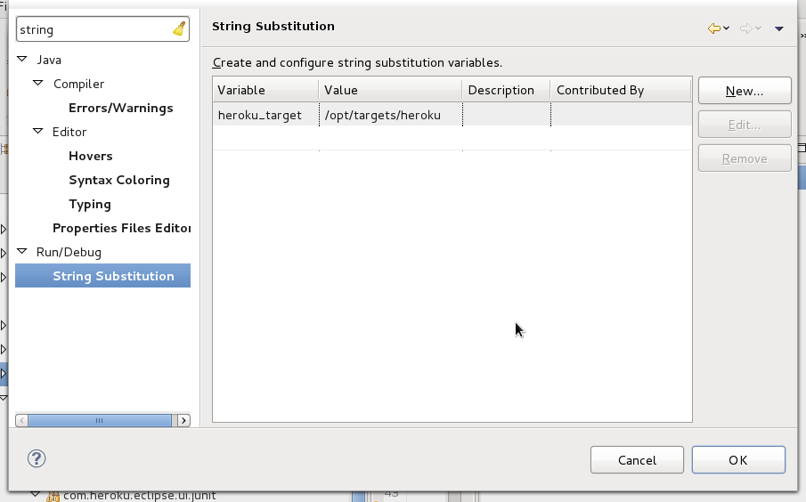
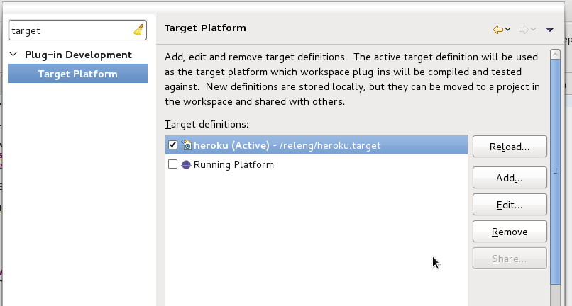
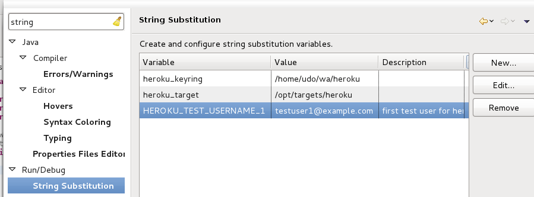
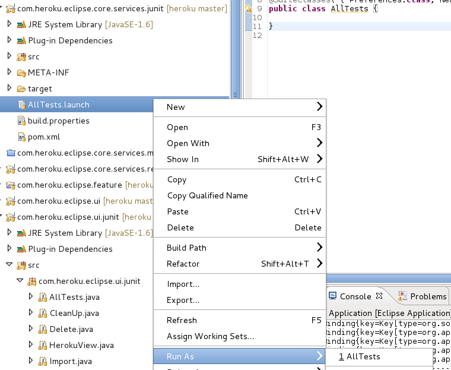
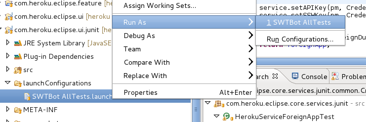

Heroku Eclipse Plugin 0.1.0 Development Setup
=============================================

***BestSolution.at EDV Systemhaus GmbH***

**Project: Heroku Eclipse plugin***

**Author: Tom Schindl**

**Version: 2012-07-27***

***Copyright (c) by BestSolution.at EDV Systemhaus GmbH***

***All Rights Reserved.***

***BestSolution.at MAKES NO REPRESENTATIONS OR WARRANTIES ABOUT THE
SUITABILITY OF THIS SPECIFICATION, EITHER EXPRESS OR IMPLIED, INCLUDING
BUT NOT LIMITED TO THE IMPLIED WARRANTIES OF MERCHANTABILITY, FITNESS
FOR A PARTICULAR PURPOSE, OR NON-INFRINGEMENT OR ANY WARRANTY OTHERWISE
ARISING OUT OF ANY PROPOSAL, SPECIFICATION OR SAMPLE.***

***No license, express or implied, by estoppel or otherwise, to any
intellectual property rights is granted herein.***

***This Specification as well as the software described in it is
furnished under license and may only be used or copied in accordance
with the terms of the license. The information in this document is
furnished for informational use only, is subject to change without
notice, and should not be construed as a commitment by BestSolution.at.
BestSolution.at assumes no responsibility or liability for any errors or
inaccuracies that may appear in this document or any software that may
be provided in association with this document.***

***This specification must not be used, redistributed, stored,
transmitted or based upon in any other than the designated way without
express written consent of BestSolution.at.***

Abstract
========
Heroku Eclipse plugin is an extension to the well known Eclipse Java
IDE, allowing developers to work with their existing heroku applications
or create new ones using predefined templates. It also allows users to
manage their existing applications in terms of performance, monitoring,
user management and more.

This document describes how to set up the environment to develop the
plugin itself.

Downloading essential pieces
============================

1.  Download Eclipse \>= 3.7.2 from
    [http://www.eclipse.org](http://www.eclipse.org/)

2.  Install the eGit plugin from
    [http://download.eclipse.org/egit/updates](http://download.eclipse.org/egit/updates)

3.  Install the SWTBot plugin from
    [http://download.eclipse.org/technology/swtbot/helios/dev-build/update-site](http://download.eclipse.org/technology/swtbot/helios/dev-build/update-site)

Preparing the "target platform"
===============================

The "target platform" is a collection of software "pieces" required to
develop the plugin. Those pieces are typically other Eclipse bundles and
plugins. As such, the required pieces must be downloaded and stored in a
static location.

Create a local folder structure on your filesystem
--------------------------------------------------

Proposed base location:

-   win32: C:\\dev\\heroku_plugin\\target

-   mac: /Users/$USER/dev/heroku_plugin/target
    replace $USER with your real user name

-   linux: /opt/heroku_plugin/target

Create three folders inside the "target" folder from above:

-   delta-pack-37

-   jdt-37

-   platform-37

Download Eclipse SDK 3.7.0 for your Platform
--------------------------------------------

Download from
[http://archive.eclipse.org/eclipse/downloads/drops/R-3.7-201106131736/](http://archive.eclipse.org/eclipse/downloads/drops/R-3.7-201106131736/)

-   Platform SDK - Platform Source Repo

-   DeltaPack - All

-   JDT SDK - JDT Source Repo

Unzip the downloaded zip-Files and move the content to the respective
target folders so that the folder structure now looks like this

-   target

    -   delta-pack-37

        -   features

        -   ...

    -   jdt-37

        -   artifacts.jar

        -   ...

    -   platform-37

        -   artifacts.jar

        -   ...

Configure workspace to compile for a specific target
====================================================

1.  Open the Eclipse Preferences and navigate to "Run/Debug \> String
    Substitution"

2.  Create a new substitution using the "New ..." button on the right

    **Name:** heroku_target

    **Value:** Location of your target folder e.g.
    "/Users/$USER/dev/heroku_plugin"

    
    *Illustration 1: set up the "heroku_target" Eclipse variable*

3.  Clone the heroku-git repo from github.com and import the following
    plugins:

 - `com.heroku.api`: OSGi wrapper for the heroku-api.jar
 - `com.heroku.eclipse.core.serivces`: Service interface definitions
 - `com.heroku.eclipse.core.services.junit`: Service unit tests
 - `com.heroku.eclipse.core.services.rest`: REST service implementation
 - `com.heroku.eclipse.feature`: Eclipse feature definition for the plugin
 - `com.heroku.eclipse.ui`: UI code
 - `com.heroku.eclipse.ui.junit`: UI unit tests
 - `com.heroku.eclipse.updatesite`: Bundle defining how the plugin’s update site is created
 - `heroku-eclipse-useragent`: UserAgentValueProvider implementation identifying the Eclipse plugin
 - `releng`: Release engeneering stuff, defining ie. the target platform used for automated building

4.  Open the Eclipse Preferences and navigate to "Plug-in Development \>
    Target Platform" and set the checkbox on the "heroku" entry in the
    list, that will appear once the git cloning from step 3 has been
    completed:

    \
    *Illustration 2: activate the "heroku” target platform*

Launching the plugin from within the IDE
========================================

To launch an internal Eclipse session of the plugin, open the context
menu on the "Package Explorer" and select "Run As \> Eclipse
Application".

An additonal Eclipse instance should come up now, integrating the plugin
from the development instance.

Running JUnit-Tests
===================

Launch core JUnit-Tests
-----------------------

The "core" JUnit tests cover the entire "service" side of the plugin and
do not use any GUI code, residing in the *com.heroku.eclipse.ui*bundle.
The UI is tested seperately, see Launch UI JUnit-Tests on page 9.

First unzip the seperatly available "keyring.zip" file into your
"target" directory from step Preparing the "target platform" on page 5.

Before launching any tests, set up a couple of additional Eclipse
variables. That can either be done on the operating system, environment
variables level or inside Eclipse again.

Open the Eclipse preferences, navigate to "Run/Debug \> String
Substitution" and create the following new substitutions using the "New
..." button on the right :

\
*Illustration 3: adding variables required for testing*

1.  **Name:** HEROKU_TEST_USERNAME_1, **Value:** $USER1

2.  **Name:** HEROKU_TEST_PWD_1, **Value:** $PWD1

3.  **Name:** HEROKU_TEST_APIKEY_1, **Value:** $API_KEY1

4.  **Name:** HEROKU_TEST_USERNAME_2, **Value:** $USER2

5.  **Name:** HEROKU_TEST_PWD_2, **Value:** $PWD2

6.  **Name:** HEROKU_TEST_APIKEY_1, **Value:** $API_KEY2

$USER1, $PWD1 and $API_KEY1 have to be replaced by valid heroku user
account data used for testing. The same goes for $USER2, $PWD2 and
$API_KEY2.

In order to run the tests, the local user must have setup valid and
*passwordless* SSH keys in the development Eclipse.

\
*Illustration 4: run all core tests*

Finally open the context menu on "...core.services.junit/All Tests.launch"
and select "Run As \> All Tests":

Launch UI JUnit-Tests
---------------------

The UI JUnit tests are based upon SWTBot. SWTBot allows to run an
application and behave like an immaginary user clicking on buttons,
filling in text and so on.

Furthermore, in order to run the tests, the local user must have setup
valid and *passwordless* SSH keys password in the development Eclipse.

\
*Illustration 5: run all UI JUnit tests*

Once the plugin has been installed, run the UI tests by right clicking
the launcher config found in
"...core.services.ui.junit/launchConfigurations/SWTBot AllTests.launch".

Development Requirements
========================

The plugin was developed using Eclipse 3.7.2, running on Java 6 on
standard Fedora^®^ Core 17 and OS/X^®^ Lion workstations.

It has been tested to run under Windows^®^ XP SP3 and Windows^®^ 7 SP1,
running the latest Java 6 version.

Status of this Document
=======================

2012-07-26: initial creation,
[tom.schindl@bestsolution.at](mailto:tom.schindl@bestsolution.at)

2012-07-27: UI unit tests setup, short description of the plugins, minor
text corrections,\
 installation requirements,
[udo.rader@bestsolution.at](mailto:udo.rader@bestsolution.at)
